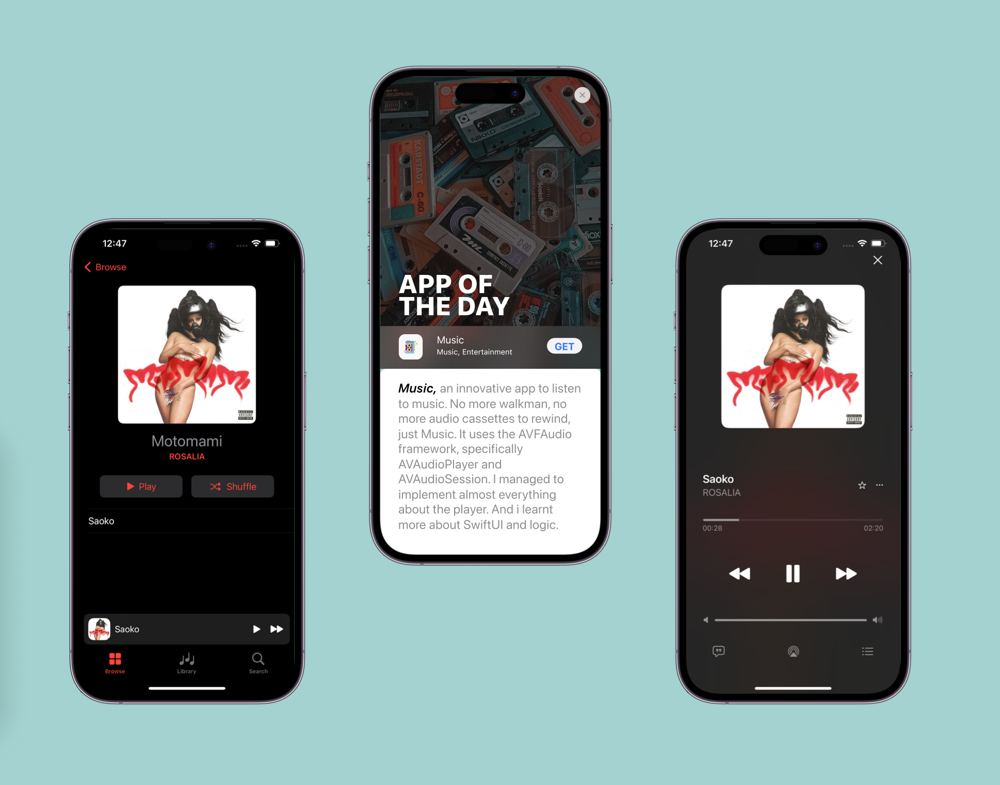

# 🎧 Music

This project was for educational purposes only.
I tried to recreate Apple Music in order to learn how to build a music player, manage audio and reinforce concepts like User Interaction and Data Flow.

## 🔧 Technologies and Practices

- <b>AVFAudio</b> 
To build the music player and manage the audio playback and the songs' queue.
- <b>Data Flow and MVVM</b> 
I really learnt a lot on how to manage data, and improve the user experience.

